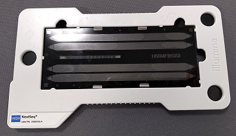
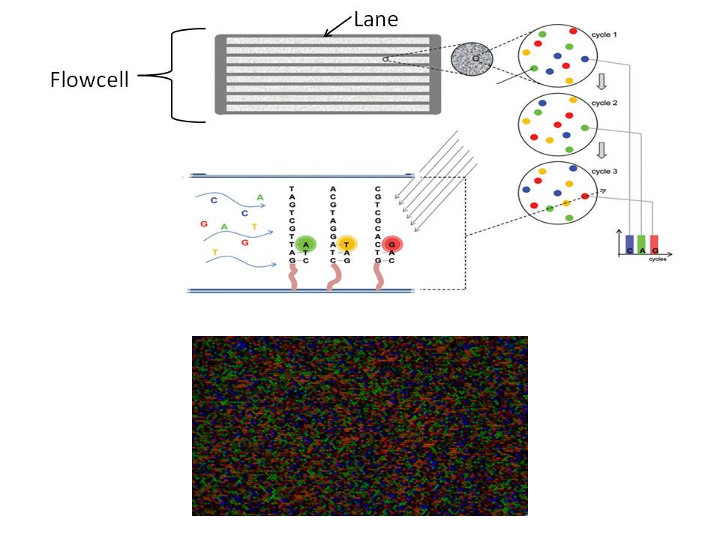

## About FASTQ 
FASTQ is a common file format used in bioinformatics and genomics to represent raw DNA sequencing data. It contains information about the sequences of DNA or RNA fragments obtained from a high-throughput sequencing experiment, along with quality scores for each base in the sequence. The name "FASTQ" is derived from the file extension ".fastq." FASTQ files can be generated by various sequencing platforms and are used in a wide range of bioinformatics applications, including genome assembly, variant calling, and transcriptomics analysis.

Although it looks complicated (and maybe it is), the FASTQ format is easy to understand with a little decoding. A typical FASTQ file consists of four lines for each sequence entry:

1. **Header/Identifier line** (starts with '@'): This line contains information about the sequence, often including a unique identifier, sequencing machine information, and other metadata.
2. **Sequence line**: This line contains the actual sequence of DNA or RNA bases represented by letters (A for Adenine, T for Thymine, C for Cytosine, G for Guanine, and N for ambiguous bases).
3. **Quality score header line** (starts with '+'): This line is usually just a placeholder and is often identical across all sequences in the file.
4. **Quality scores line**: Has a string of characters which represent the quality scores associated with each base of the nucleic sequence; must have the same number of characters as line 2

Here is an example of a FASTQ entry:

```
@M00970:337:000000000-BR5KF:1:1102:17745:1557 1:N:0:CGCAGAAC+ACAGAGTT
GTGCCAGCCGCCGCGGTAGTCCGACGTGGCTGTCTCTTATACACATCTCCGAGCCCACGAGACCGAAGAACATCTCGTATGCCGTCTTCTGCTTGAAAAAAAAAAAAAAAAAAAACAAAAAAAAAAAAAGAAGCAAATGACGATTCAAGAAAGAAAAAAACACAGAATACTAACAATAAGTCATAAACATCATCAACATAAAAAAGGAAATACACTTACAACACATATCAATATCTAAAATAAATGATCAGCACACAACATGACGATTACCACACATGTGTACTACAAGTCAACTA
+
GGGGGGGGGGGGGGGGGGGGGGGGGGGGGGGGGGGGGGGGGGGGGGGGGGGGGGGGGGGGGFGGGFGGGGGGAFFGGFGGGGGGGGFGGGGGGGGGGGGGGFGGG+38+35*311*6,,31=******441+++0+0++0+*1*2++2++0*+*2*02*/***1*+++0+0++38++00++++++++++0+0+2++*+*+*+*+*****+0**+0**+***+)*.***1**//*)***)/)*)))*)))*),)0(((-((((-.(4(,,))).,(())))))).)))))))-))-(
```

In this example:
- `@M00970` is the header/identifier line.
- The second line represents the DNA sequence.
- The `+` is the quality score header. Sometimes you will see the header `+` followed by the same identifier as the header/identifier line.
- The fourth line contains the quality scores.

It means that the fragment named `@M00970` corresponds to the DNA sequence 
```
GTGCCAGCCGCCGCGGTAGTCCGACGTGGCTGTCTCTTATACACATCTCCGAGCCCACGAGACCGAAGAACATCTCGTATGCCGTCTTCTGCTTGAAAAAAAAAAAAAAAAAAAACAAAAAAAAAAAAAGAAGCAAATGACGATTCAAGAAAGAAAAAAACACAGAATACTAACAATAAGTCATAAACATCATCAACATAAAAAAGGAAATACACTTACAACACATATCAATATCTAAAATAAATGATCAGCACACAACATGACGATTACCACACATGTGTACTACAAGTCAACTA 
```
and this sequence has been sequenced with a quality 
```
GGGGGGGGGGGGGGGGGGGGGGGGGGGGGGGGGGGGGGGGGGGGGGGGGGGGGGGGGGGGGFGGGFGGGGGGAFFGGFGGGGGGGGFGGGGGGGGGGGGGGFGGG+38+35*311*6,,31=******441+++0+0++0+*1*2++2++0*+*2*02*/***1*+++0+0++38++00++++++++++0+0+2++*+*+*+*+*****+0**+0**+***+)*.***1**//*)***)/)*)))*)))*),)0(((-((((-.(4(,,))).,(())))))).)))))))-))-(.
```

We will see later how to interpret these quality scores, i.e. is `G` for good? or `)` better? but for now, just know that the higher the "score", the higher the probability that the base call is correct. 

Let's quickly discuss the header line. The header line (`@`) tells you a lot about the circumstances of where the read came from. Remember, in most sequencing technlogies we our sequenced reads are measurements taken across a flow cell. This an example of an Illumina NextSeq flow cell: 



This is the an example header line that we could see in a FASTQ file:

```
@HWI-ST863:195:D1P7AACXX:1:1101:1173:1855/1:N:0:CGCAGAAC+ACAGAGTT
```

* `@`: This is a FASTQ Header line
* `HWI-ST863`: This is the instrument name
* `195`: This is the run ID
* `D1P7AACXX`: This is the flowcell ID
* `1`: This is the flowcell lane
* `1101`: This is the tile number
* `1173`: This is the x-coordinate of the cluster
* `1855`: This is the y-coordinate of the cluster
* `/1`: This is the member of a pair, /1 or /2
* `N`: This is the filter flag. Y if the read is filtered. N otherwise.
* `0`: This is the number of control bits
* `CGCAGAAC`, `ACAGAGTT`: These are the index sequences (also known as barcode sequences)

This relates back to what we saw earlier this week. Say, for Illumina, sequencing machines contain one or more flow cells and each of these flow cells contains one or more lanes. Further, each lane has hundreds of quadrants, called tiles, containing oligos that bind your library.  Illumina machines employ sequencing by synthesis technology. First, individual reads are amplified in tight clonal clusters, which is done to increase signal. This amplification uses the terminal elements of the adapter in a process referred to as bridge amplification. After amplification, a PCR-like reaction is used to incorporate fluorescent nucleotides one at a time.



For each sequencing cycle completed, an image like the one above is produced. Each colored dot corresponds to a clonal cluster derived from one DNA fragment. Illumina's processing algorithm takes images like the one above and translates it into a base call for each read at each position, along with a corresponding measure of certainty in the base call.

Many issues can arise during the sequencing by synthesis process. A common issue is the tendency for some fragments in a clonal cluster to not incorporate a nucleotide toward the end of the process, when sequencing reagents become more limiting. This leads to ambiguity in base calls near the 3' end of reads. We will see examples of these errors (as the manifest in the output sequencing data) by the end of the module. 

### Representing errors or uncertainty in sequencing data

Modern sequencing technologies can generate a massive number of sequence reads in a single experiment. However, no sequencing technology is perfect, and each instrument will generate different types and amount of errors, such as incorrect nucleotides being called. These wrongly called bases are due to the technical limitations of each sequencing platform.

Therefore, it is necessary to understand, identify and exclude error-types that may impact the interpretation of downstream analysis. Sequence quality control is therefore an essential first step in your analysis. Catching errors early saves time later on.

**But what does this quality score mean?**

The quality score for each sequence is a string of characters, one for each base of the nucleotide sequence, used to characterize the probability of misidentification of each base. The score is encoded using the ASCII character table (with some historical differences): 


To save space, the sequencer records an ASCII character to represent scores 0-42. For example 10 corresponds to “+” and 40 corresponds to “I”. This is often called “Phred” scoring.

So there is an ASCII character associated with each nucleotide, representing its Phred quality score, the probability of an incorrect base call:

| Phred Quality Score | Probability of incorrect base call | Base call accuracy |
|---------------------|------------------------------------|--------------------|
| 10                  | 1 in 10                            | 90%                |
| 20                  | 1 in 100                           | 99%                |
| 30                  | 1 in 1000                          | 99.9%              |
| 40                  | 1 in 10,000                        | 99.99%             |
| 50                  | 1 in 100,000                       | 99.999%            |
| 60                  | 1 in 1,000,000                     | 99.9999%           |

What does 0-42 represent? These numbers, when plugged into a formula, tell us the probability of an error for that base. This is the formula, where Q is our quality score (0-42) and P is the probability of an error:
```
Q = -10 log10(P)
```

Using this formula, we can calculate that a quality score of 40 means only 0.00010 probability of an error.

### Exercise 1: Review questions 

**For the FASTQ header line below, what is the run ID, the indexes used and name of the instrument?**

```
@M00970:337:000000000-BR5KF:1:1102:17745:1557 1:N:0:CGCAGAAC+ACAGAGTT
```

**Which ASCII character corresponds to the worst Phred score for Illumina 1.8+?**
1. What is the Phred quality score of the 3rd nucleotide of the 1st sequence?
1. What is the accuracy of this 3rd nucleotide?

(answers below)
1. The worst Phred score is the smallest one, so 0. For Illumina 1.8+, it corresponds to the ! character.
1. The 3rd nucleotide of the 1st sequence has a ASCII character G, which correspond to a score of 38.
1. The corresponding nucleotide G has an accuracy of almost 99.99%

## Download example data 

```
wget https://zenodo.org/record/3977236/files/female_oral2.fastq-4143.gz  
```


[Back to Programme]({{site.baseurl}}/modules/sequencing/week-2-programme/).
